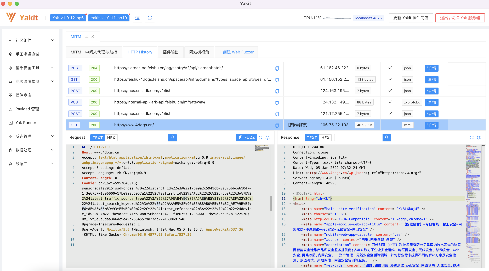
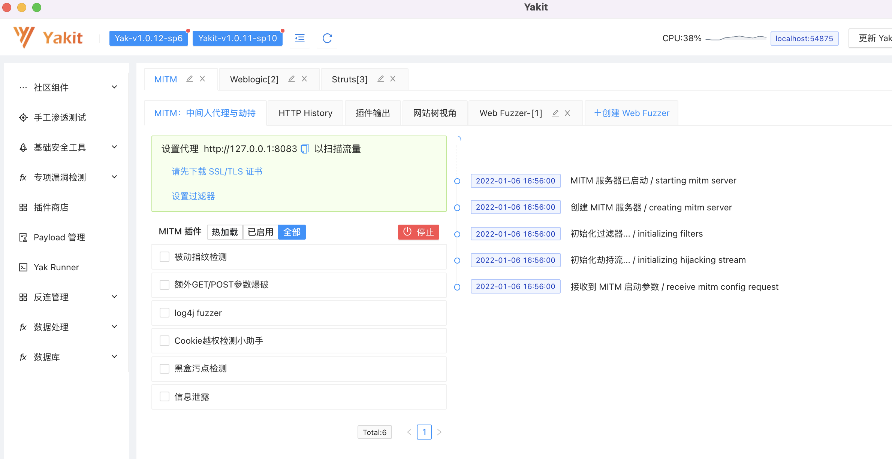
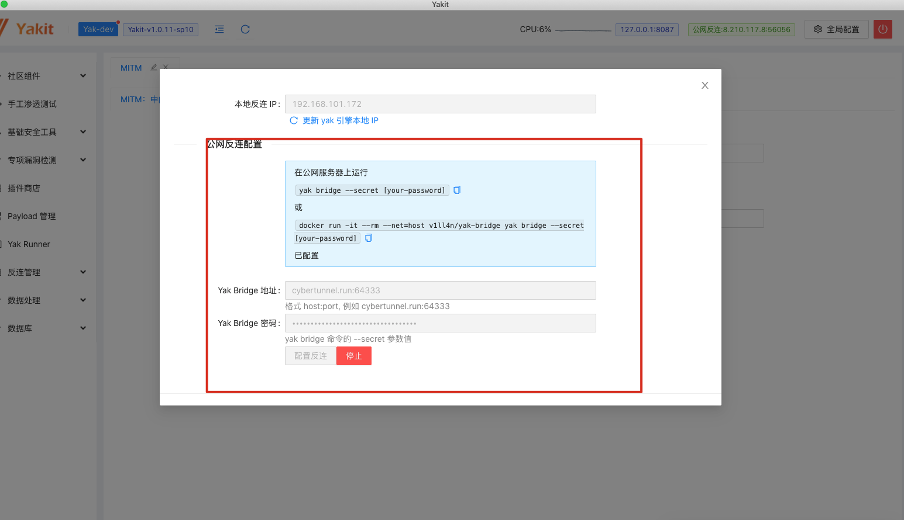

# YAKIT-A Cyber Security ALL-IN-ONE Platform based on Yak language

## Disclaimer

1. This tool is only for **legally authorized** enterprise security construction behaviors and personal learning behaviors. If you need to test the usability of this tool, please build a virtual environment by yourself.

2. When using this tool for pentesting, you should ensure that the behavior complies with local laws and regulations and has obtained sufficient authorization. Do not scan unauthorized targets.
3. Reverse engineering, decompiling, attempting to decipher the source code, implanting backdoors to spread malware, etc. on this software are prohibited.

If you have any illegal behavior when using this tool, you shall bear the corresponding consequences by yourself, and we will not bear any legal and joint responsibility.

Before installing and using this tool, please **read carefully and fully understand the terms**

Unless you have fully read, fully understood and accepted all the terms of this agreement, please do not install and use this tool.Your use behavior or your acceptance of this Agreement in any other express or implied manner shall be deemed to have been read and agreed to be bound by this Agreement

## 1. Introduction to YAK language

A group of engineers with rich experience in network security are dissatisfied with the existing general-purpose programming languages - what they want is an open source language with the high concurrent execution capabilities like Golang; simple syntax like Python; it should be a scripting language, so that can be quickly distributed to peers; it should be easy to write and execute directly without installing third-party libraries; it must natively have common network security capabilities, such as port detection, SYN stateless scanning, and Nmap's service fingerprints, and provide functional call; also, it should be Turing-complete and easy to learn...

So, We create YAK.

YAK is the world's first "Domain Specific Language" for cyber security, providing very powerful security capabilities. Yak is a superset of most "data description languages/container languages".It has following features：

1. Execution efficiency and features are exactly like Go Native；Yak can have all the capabilities and library of GoLang.
2. Provide various underlying security capabilities through functions, including port scanning, fingerprinting, poc framework, shell management, MITM hijacking, etc.
3. With yak, you can implement any upper-level security capabilities you want  through low-level calls at the function level.
4. Supporting an VSCode-like plug-in, providing a certain degree of automatic completion function.
5. Golang modules are natively compatible, and all functions that can be implemented in Golang can be integrated in Yak.
6. The syntax can be customized,  easy to write.
7. Turing complete scripting language.
8. ……

## 2. Introduction to Yakit Platform

Yakit is a cyber security tool based on the yak language. It aims to create a network security tool library covering the whole process of penetration testing.

In order to make the security capabilities of the Yak language more easily accepted and used by everyone, we wrote a gRPC server for Yak, and used this server to build a client: Yakit, which lowered the threshold for everyone to use Yak through the interface GUI. Yakit has the following features:

1. MITM module implements all core functions of BurpSuite

2. A superset of Poc/Exp.Fast vulnerability detection of targets through GUI interface.

3. The "Strongest In History" plug-in system design, you can have everything you want

4. Yak Code Runner：Yak language cloud IDE with built-in autocompletion.

5. Natively supported intranet penetration, greatly increasing the efficiency of lateral movement.

6. Native testing of Java class vulnerabilities without relying on the Java environment

7. ……

### 2.1 Young challenger of Burpsuite

Burpsuite has almost become a must-install security testing tool for WEB security researchers around the world, but in recent years there has been no alternative solution. The cracked version has a high risk of being poisoned, the commercial version is too expensive, the plug-ins are difficult to write, and problems such as relying on java are gradually revealed.Our team has  implemented the core functions of BurpSuite based on yak, and expects to give all researchers a new choice.Complete replacement is not our ultimate goal. Substituting and surpassing, effectively lowering the threshold and improving work efficiency are our goal.

At present, we have implemented the common functions of BurpSuite, including intercepting and modifying request/response, history module, repeater module, intruder module, and innovatively implemented GUI label fuzz in our fuzz module, which has a better Scalability

**HTTP History**：



**WEB Fuzzer:**


**Passive Vulnerability Detection System:**




### 2.2 Superset of Poc/Exp

In the process of penetration testing, we often have a requirement: it is known that the target uses a middleware like weblogic/struts2, etc., and we want to detect whether there is a specified vulnerability on the target with one-click. However, for such a simple demand, we have to open various special tools and keep switching on various tabs. Even having to switch Windows/Linux OS in order to install a certain tool, or install a bunch of complicated dependencies.

But on Yakit，You just need to enter the target, click the start detection button, and you can get the result quickly.


In order to quickly improve the detection ability of POC，We have natively integrated "nuclei" in yak language，Of course, in the plug-in module, you can write all kinds of POCs you want based on yak/yaml, and quickly display the plug-in in the left menu bar.

### 2.3 "The strongest on the World" plug-in system

As a platform, it is naturally inseparable from a plug-in system that can be rapidly expanded。In theory, for a plug-in with an GUI interface, the writer needs to be familiar with both the front-end and the back-end, which increases the threshold for developers。Different from other platforms, when we design this system, the core code of the plug-in is all implemented with yak language, and the interaction with the interface can be realized through the yakit library，In addition, in order to be worthy of "the strongest on the surface", you can also refer to the description of the following articles:

[Plug-in Design Ideas](https://www.yaklang.io/products/professional/yak-script-system)

[Plug-in writing guide](https://www.yaklang.io/products/professional/yakit-plugin-how-to)


### 2.4 The Design of Teamserver

Yak core engine and yakit are installed separately，Yakit is only a GUI client. So ,there are two modes of using Yakit:

1. Local Mode：Starts a `yak grpc` server with a random port by default

2. Remote Mode：

   ```
   yak grpc --host 0.0.0.0 --port 60000
   ```

   You can launch it on any platform / any network location, including:

   * Remote hosting Like ECS/VPS

   * Local PC

   * Intranet environment

In addition, we also added the brige mode, which can easily map the internal network to the public network ,In this mode, we no longer need to install port forwarding tools such as frp, but perform lateral movement of the intranet under a GUI interface, which greatly improves the test efficiency.



### 2.5 Native JAVA deserialization capability support

At present, when we want to detect java deserialization vulnerabilities, we usually need to use [ysoserial](https://github.com/frohoff/ysoserial) in the stage of payload generation.However, this solution requires the installation of the java environment, and there is a risk of being countered.Yakit uses Yak-Language to natively support the java deserialization protocol, so that we can easily test the target quickly by writing Yak scripts.


See the article for usage details[”New Year's Gift: Breaking Java Serialization Protocol Language Isolation with Yakit“](https://mp.weixin.qq.com/s/HdUARJFQu3WMWvvqs9VGyg )

## 3. Our goal

	As a young challenger of Burpsuite，Our first goal is to be as technically deep as Burpsuite，give users of the cracked version of Burpsuite a better and safer choice.But our footsteps will not stop here. Our dream is to become a "matlab" in the cyber security field, with powerful and rich algorithm capabilities, we will become the base of the cyber security.
	What Yak and Yakit want to do is to provide everyone a product with strong and complete security capabilities.We not only want to provide you a useful tool, but also to comprehensively improve your security capabilities.Most products in the field emphasize fool-like one-click operation and result visualization，What we emphasize is the user's sense of participation in the operation. In the process of continuous learning, just like upgrading and fighting monsters, everyone can transform from a newer to a professional user. 

## 4. Contact US

Our Email:

If you have any constructive comments or BUG feedback on our products, you are welcome to open an issue

Or contact us through WeChat official account, and welcome to contact business authorization and cooperation

If you want to join the exchange group or have any questions and want to communicate with the technical staff, please contact and add the WeChat account:


